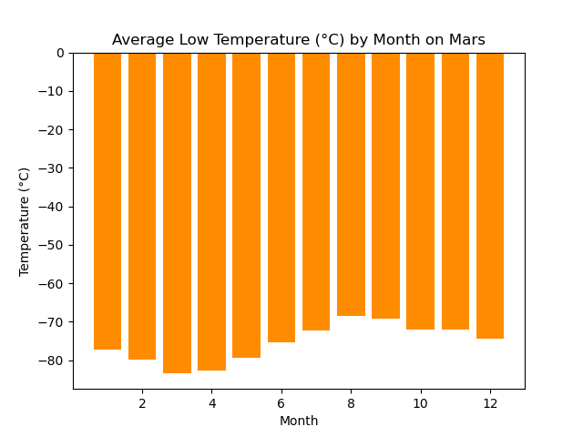
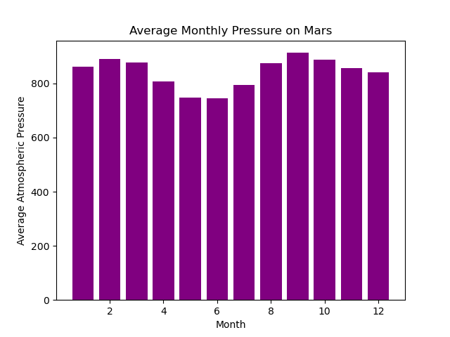
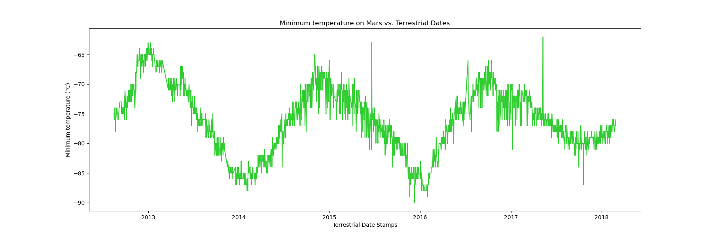

# Mars-Scrape

**About this Project:**

This web-scraping project consists of two parts (part_1_mars_news.ipynb, part_2_mars_weather.ipynb ):

1. Deliverable 1: Scrapes the titles and previews text from Mars news articles.

2. Deliverable 2: Scrapes and analyzes Mars weather data, which exists in a table.

**Part 1:**

- Uses automated browsing to visit the Mars News site

- Creates a Beautiful Soup object and uses it to extract/ scrape the title and preview of Mars news articles 

**Part 2:**

- Uses automated browsing to visit the Mars Temperature Data Site and creates a Beautiful Soup object to extract elements

- Assembles scraped data into a Pandas DataFrame with columns matching the table on the website

- Using Pandas functions on the dataset, several qustions were addressed: 

1. How many months exist on Mars?: 12

2. How many Martian days worth of data exist in the scraped dataset?: 1867

3. What are the coldest and the warmest months on Mars (at the location of Curiosity)?: by finding the average minimum daily temperature for all of the months, we can can plot the data as a bar chart. We see from the bar chart that the month 3 seems to be the coldest and month 8 seems to be the 'warmest'. Though as we can see it is always very cold (far below 0°C) on Mars.

4. Which months have the lowest and the highest atmospheric pressure on Mars?: by finding the average daily pressure for all months on mars, we can plot the results by month. We can see from the bar chart that month 6 seems to have the lowest atmospheric pressure and month 9 seems to have the highest.

5. How many terrestrial (Earth) days are there in a Martian year?: When the solar longitude (ls) is 0 degrees, Mars has completed one full orbit around the Sun(meaning that one Martian year has passed). In order to find the number of Earth days in a Martian year, I calculated the time difference (using .diff) between two terrestrial dates where (ls)=0. The results showed that there are approximately 686 Earth days in a Martian year. The visual plot of 'Minimum temperature on Mars vs. Terrestrial Dates' helps to visually estimate these results. 

- Finally, the orignal DataFrame was exported into a csv which can be found in the 'Output' folder.

 